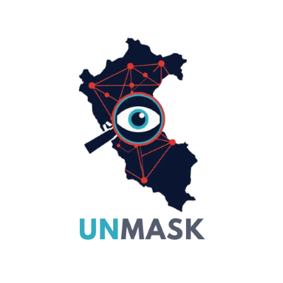

# UNMASK — Análisis de la Red Territorial del Crimen en Perú

<p align="center">
  
</p>

<p align="center">
  <b>Sistema de Monitoreo y Análisis de Incidencias Delictivas</b><br/>
  Detección de puntos críticos y rutas de propagación delictiva mediante teoría de grafos
</p>

<p align="center">
  
  
  
  

</p>

---

## Tabla de Contenidos

- [Descripción del Proyecto](#-descripción-del-proyecto)
- [Contexto del Problema](#-contexto-del-problema)
- [Dataset SIDPOL](#-dataset-sidpol)
- [Arquitectura del Sistema](#-arquitectura-del-sistema)
- [Algoritmos Implementados](#-algoritmos-implementados)
- [Interfaz de Usuario](#-interfaz-de-usuario)
- [Instalación](#-instalación)
- [Uso](#-uso)
- [Estructura del Proyecto](#-estructura-del-proyecto)
- [Resultados y Validación](#-resultados-y-validación)
- [Conclusiones](#-conclusiones)
- [Integrantes](#-integrantes)
- [Referencias](#-referencias)

---

## Descripción del Proyecto

**UNMASK** es una aplicación de escritorio desarrollada en Python que analiza la distribución territorial del crimen en el Perú a nivel distrital, modelando la red delictiva como un **grafo no dirigido y ponderado** sobre los datos del Sistema de Denuncias Policiales (SIDPOL 2024-2025).

El sistema permite:

- Visualizar la distribución geográfica del crimen por departamento, provincia y distrito
- Construir y explorar grafos territoriales de más de **1 800 nodos** (distritos del Perú)
- Aplicar algoritmos clásicos de grafos: **BFS, DFS, Floyd-Warshall y Kruskal (MST)**
- Identificar nodos estratégicos, rutas críticas de propagación y distritos puente
- Generar reportes ejecutivos para la toma de decisiones en seguridad ciudadana

---

## 🚨 Contexto del Problema

La extorsión constituye una de las principales amenazas para la seguridad ciudadana y el desarrollo económico en el Perú:

| Indicador | Valor |
|-----------|-------|
| Denuncias por extorsión (2025) | > 23 000 casos |
| Incremento respecto al año anterior | ~30 % |
| Empresas afectadas por extorsión/sicariato (2019-2024) | > 2 millones |
| Crecimiento de casos en 5 años | ~500 % |
| Empresas de transporte víctimas de extorsión (Lima/Callao) | > 70 % |

> *Fuentes: Ministerio del Interior del Perú (2025), Infobae Perú, Willax, RPP Noticias, Cámara de Comercio de Lima*

Los análisis convencionales basados en cifras agregadas resultan insuficientes para comprender la **dinámica espacial y la propagación delictiva**. UNMASK aplica teoría de grafos para revelar la estructura oculta de la red criminal territorial.

---

## Dataset SIDPOL

### Origen
**Base de datos del Sistema de Denuncias Policiales (SIDPOL)** — Ministerio del Interior del Perú, publicada a octubre de 2025.

- 🔗 [Dataset oficial SIDPOL](https://www.gob.pe/institucion/mininter/informes-publicaciones/7384293-base-de-datos-del-sidpol-a-octubre-del-2025)
- 🔗 [Cartografía GeoJSON — Perú distrital](https://github.com/juaneladio/peru-geojson)

### Variables principales

| Variable | Descripción |
|----------|-------------|
| `ANIO` | Año de registro del hecho |
| `MES` | Mes de registro |
| `UBIGEO_HECHO` | Código UBIGEO del lugar del hecho |
| `DPTO_HECHO_NEW` | Departamento donde ocurre |
| `PROV_HECHO` | Provincia donde ocurre |
| `DIST_HECHO` | Distrito donde ocurre |
| `TIPO` | Categoría general del delito |
| `SUB_TIPO` | Subcategoría del delito |
| `MODALIDAD` | Modalidad específica |

### Cobertura
- **250 666+** registros totales (2024-2025)
- **1 004+** distritos analizados por los filtros activos
- **25 departamentos** del Perú
- Tipos de delito: Extorsión, Homicidio, Robo, Hurto, Violación, y más de **50 subtipos**

---

## Arquitectura del Sistema

```
UNMASK v2
├── Módulo de Entrada de Datos
│   ├── SIDPOL_DATASET.csv  (denuncias 2024-2025)
│   ├── peru_distrital_simple.geojson  (límites distritales)
│   └── peru_departamental_simple.geojson  (límites departamentales)
│
├── Módulo de Procesamiento Interno  (modulos/dashboard.py, explorar_grafo.py)
│   ├── Limpieza y normalización de datos
│   ├── Integración con cartografía GeoPandas
│   └── Cálculo de conteos y métricas territoriales
│
├── Módulo de Análisis Algorítmico  (modulos/algoritmos.py)
│   ├── Construcción del grafo de adyacencia (contigüidad distrital)
│   ├── BFS / DFS — expansión territorial
│   ├── Floyd-Warshall — rutas críticas
│   └── Kruskal MST — red mínima de conexión
│
└── Módulo de Visualización  (Unmask.py + modulos/widgets.py)
    ├── Dashboard con mapa de calor
    ├── Explorador de grafo interactivo
    ├── Visor de resultados algorítmicos
    └── Reporte estratégico consolidado
```

### Modelo del Grafo

```
G = (V, E)

V (nodos): cada distrito del Perú con denuncias registradas (~1 800)
  Atributos: nombre, casos totales, casos por subtipo, UBIGEO, población

E (aristas): conexión entre distritos con frontera administrativa compartida
  Peso: peso(u, v) = casos(u) + casos(v)

Tipo: No dirigido, ponderado, geográfico
```

---

## Algoritmos Implementados

### 1. BFS / DFS — Expansión Territorial del Delito

Analiza cómo se expande la actividad delictiva desde un distrito epicentro hacia sus vecinos.

```
BFS: Recorre nivel por nivel (ancho) — ideal para detectar cobertura por distancia
DFS: Recorre en profundidad — ideal para detectar corredores delictivos largos

Complejidad: O(V + E)
```

**Salidas:**
- Árbol de expansión con niveles de propagación
- Agrupaciones (clusters) de alta concentración
- Nodos frontera (expansión activa)
- Velocidad y dirección de expansión detectada

### 2. Floyd-Warshall — Rutas de Mayor Concentración

Calcula las rutas de mayor concentración de denuncias entre **todos los pares de distritos**.

```
Matriz D[i][j] = costo mínimo del camino más corto entre i y j
Costo = 1 / (casos(u) + casos(v) + 1)   [modo: mayor concentración]
Costo = casos(u) + casos(v)              [modo: ruta eficiente]

Complejidad: O(V³)  —  optimizado con pruning de bbox para grandes grafos
```

**Salidas:**
- Top-N rutas críticas ordenadas por concentración de denuncias
- Distritos puente (alta frecuencia en rutas)
- Análisis de vulnerabilidad territorial

### 3. Kruskal (MST) — Red Mínima de Intervención

Encuentra el **árbol de expansión mínima** que conecta todos los distritos con el menor "costo" (mayor concentración delictiva relativa).

```
Orden de aristas por costo ascendente (1/peso)
Union-Find para evitar ciclos
MST resultante: V-1 aristas que conectan toda la red

Complejidad: O(E log E)
```

**Salidas:**
- Columna central de conexión delictiva (aristas esenciales)
- Porcentaje de reducción de complejidad respecto al grafo original
- Nodos críticos con mayor acumulación de casos
- Comparativa grafo original vs MST

---

## Interfaz de Usuario

La interfaz está desarrollada en **Tkinter puro** con un diseño oscuro moderno, organizada en 4 secciones principales:

### Dashboard
- **4 tarjetas de métricas** con animación de barra de carga
- **Mapa de calor territorial** generado con GeoPandas + Matplotlib
- **Top 5 departamentos** con casos de extorsión y homicidio
- **Alerta crítica nacional** dinámica

### Explorar Grafo
- **Filtros interactivos**: departamento, tipo de delito, año, modo de color
- **Visualización del grafo** con posicionamiento geográfico real de los distritos
- **Panel de estadísticas**: nodos, aristas, densidad, grado promedio
- **Leyenda dinámica** según modo de visualización (casos vs. conectividad)

### Algoritmos de Análisis
- **Tab selector** entre BFS/DFS, Floyd-Warshall y Kruskal MST
- **Controles específicos** por algoritmo (distrito inicial, modo, K nodos)
- **Visualización del grafo resultado** con colores por categoría
- **Panel de 4 métricas** del algoritmo ejecutado
- **Detalle expandido** en texto con niveles, clusters, rutas y puentes

### Resultados Estratégicos
- **Resumen consolidado** de los 3 algoritmos en un solo informe
- **Tarjetas de nodos estratégicos** con sigla, rol, nivel de riesgo y recomendación policial
- **Rutas críticas** coloreadas por nivel de riesgo (Crítico / Alto / Medio)
- **Visualización del MST** con conexiones críticas y métricas de eficiencia

---

## 🚀 Instalación

### Requisitos previos
- Python **3.10** o superior
- Tkinter (incluido en la instalación estándar de Python en Windows/macOS)
- En Ubuntu/Debian: `sudo apt-get install python3-tk`

### Pasos

```bash
# 1. Clonar el repositorio
git clone https://github.com/brianna-salinas/Unmask.git
cd Unmask

# 2. (Recomendado) Crear entorno virtual
python -m venv venv

# Windows
venv\Scripts\activate

# Linux / macOS
source venv/bin/activate

# 3. Instalar dependencias
pip install -r requirements.txt

# 4. Ejecutar la aplicación
python Unmask.py
```

### Dependencias principales

| Librería | Versión mínima | Uso |
|----------|---------------|-----|
| `pandas` | 2.0.0 | Manejo del dataset SIDPOL |
| `geopandas` | 0.14.0 | Cartografía y geometrías distritales |
| `networkx` | 3.2 | Construcción y análisis de grafos |
| `matplotlib` | 3.8.0 | Generación de visualizaciones |
| `numpy` | 1.26.0 | Cálculos matriciales (Floyd-Warshall) |
| `Pillow` | 10.0.0 | Renderizado de imágenes en la GUI |
| `shapely` | 2.0.0 | Operaciones geoespaciales |

---

## Uso

### Credenciales de acceso (demo)
```
Usuario: Usuario    Contraseña: 1234
Usuario: Maria      Contraseña: U202311258
Usuario: Brianna    Contraseña: U202410239
```

### Flujo de uso recomendado

```
1. DASHBOARD
   └── Revisar métricas nacionales y mapa de calor

2. EXPLORAR GRAFO
   ├── Seleccionar departamento de interés
   ├── Filtrar por tipo de delito (Extorsión / Homicidio / Todos)
   └── Generar grafo para visualización exploratoria

3. ALGORITMOS
   ├── BFS/DFS → Seleccionar departamento + distrito inicial
   ├── Floyd-Warshall → Seleccionar departamento + modo (volumen/eficiencia)
   └── Kruskal MST → Seleccionar departamento (K opcional)

4. RESULTADOS
   └── Generar resumen estratégico consolidado del departamento
```

### Filtros disponibles

| Filtro | Opciones |
|--------|----------|
| Departamento | 25 departamentos del Perú |
| Tipo de delito | Todos / Solo Extorsión / Solo Homicidio / Extorsión + Homicidio |
| Año | 2024 / 2025 |
| Colorear por | Volumen de casos / Conectividad |
| Modo Floyd-Warshall | Mayor concentración / Ruta eficiente |

---

## Estructura del Proyecto

```
Unmask/
├── Unmask.py                        # Aplicación principal (GUI Tkinter)
├── requirements.txt                 # Dependencias Python
├── README.md                        # Este archivo
│
├── data/
│   ├── SIDPOL_DATASET.csv           # Dataset unificado 2024-2025
│   ├── peru_distrital_simple.geojson  # Geometrías distritales
│   └── peru_departamental_simple.geojson  # Geometrías departamentales
│
├── modulos/
│   ├── __init__.py
│   ├── widgets.py                   # Componentes UI personalizados
│   ├── dashboard.py                 # Lógica del Dashboard
│   ├── explorar_grafo.py            # Construcción y visualización del grafo
│   ├── algoritmos.py                # BFS, DFS, Floyd-Warshall, Kruskal
│   └── resultados.py                # Resumen estratégico consolidado
│
├── img/
│   ├── unmask.png                   # Logo principal
│   ├── fondo_inicio.png             # Fondo pantalla de bienvenida
│   ├── fondo_acceder.png            # Fondo pantalla de login
│   └── mapa_dashboard.png           # Mapa generado (auto)
│
├── grafos_generados/                # Imágenes de grafos explorados (auto)
└── resultados_algoritmos/           # Imágenes de resultados algorítmicos (auto)
```

---

## Resultados y Validación

### Métricas del sistema (datos SIDPOL 2024-2025)

| Indicador | Valor |
|-----------|-------|
| Total registros procesados | 250 666 |
| Distritos representados | 1 004+ |
| Departamentos cubiertos | 25 |
| Casos de extorsión detectados | 8 160 |
| Casos de homicidio detectados | 1 412+ |
| Top departamento (extorsión) | Lima (4 594 casos) |

### Ejemplo — Análisis de Lima (filtro: Solo Extorsión, 2025)

```
Grafo generado:
  Nodos (distritos):  10
  Aristas (conexiones): 10
  Densidad del grafo: 0.22
  Grado promedio: 2.0

Algoritmos ejecutados:
  BFS desde SJL → Epicentre | 3 niveles | 7 nodos alcanzados | 5 435 casos
  Floyd-Warshall → 45 caminos | 3 distritos puente | Máx. 2 116 casos
  Kruskal MST → 9 aristas esenciales | Reducción 8.3% del peso total

Nodos estratégicos identificados:
  1. San Juan de Lurigancho (SJL) — Epicentro principal — 926 casos
  2. San Martín de Porres (SMP) — Nodo puente estratégico — 720 casos
  3. Ate — Distrito de tránsito — 643 casos

Rutas críticas:
  R1: SJL → ATE → LVI → LIM  (2 305 casos acumulados) — Riesgo crítico
  R2: VES → SJM → VMA         (1 792 casos acumulados) — Riesgo crítico
```

---

### Demo


---

## Conclusiones

### 1. Caracterización estructural de la criminalidad territorial
La modelación como grafo no dirigido y ponderado con más de 1 800 nodos permitió representar con precisión la distribución territorial de los delitos. Los algoritmos MST/Kruskal, Floyd-Warshall, BFS y DFS facilitaron la identificación de nodos estratégicos, rutas críticas y patrones de expansión delictiva, superando la simple agregación estadística.

### 2. Detección de zonas de alta incidencia y nodos puente
La integración de datos SIDPOL con cartografía GeoPandas generó mapas de calor y métricas de centralidad que evidencian zonas núcleo de actividad delictiva. Los nodos puente detectados son insumos valiosos para la planificación de intervenciones policiales focalizadas.

### 3. Escalabilidad y aplicabilidad metodológica
La arquitectura modular con filtros por unidad territorial, tipo de delito y periodo temporal asegura que la metodología sea replicable y adaptable a futuras actualizaciones de la base de datos SIDPOL.

### Líneas de investigación futura
- Grafos **dinámicos** con series temporales del crimen
- Integración con datos de **inteligencia policial** (PNP)
- Modelado **predictivo** con variables socioeconómicas
- Análisis **multidelito** para detectar sinergias criminales

---

**Curso:** 1ACC0184 — Complejidad Algorítmica  
**Sección:** 1408  
**Profesor:** John Edward Arias Orihuela  
**Institución:** Universidad Peruana de Ciencias Aplicadas (UPC)  
**Fecha:** Noviembre 2025  

---

## Referencias

1. **Ministerio del Interior del Perú.** (2025). *Base de datos del Sistema de Denuncias Policiales – SIDPOL a octubre del 2025.* https://www.gob.pe/institucion/mininter/informes-publicaciones/7384293-base-de-datos-del-sidpol-a-octubre-del-2025

2. **Juan Eladio.** (2023). *peru-geojson: Cartografía GeoJSON del Perú.* GitHub. https://github.com/juaneladio/peru-geojson

3. **Salazar, E.** (2025, octubre 6). CCL: casos de extorsión y sicariato avanzan casi 500% en cinco años. *Infobae Perú.* https://www.infobae.com/peru/2025/10/06/ccl-casos-de-extorsion-y-sicariato-aumentan-casi-500-en-los-ultimos-cinco-anos

4. **Siguas, C.** (2025, octubre 7). Extorsión sigue ganando terreno: se registra una denuncia cada 19 minutos. *Willax.* https://willax.pe/actualidad/aumento-extorsion-denuncias-peru-willax

5. **Silva, R.** (2025, noviembre 5). Denuncias por extorsión rompen récord histórico: Más de 23 mil solo hasta octubre del 2025. *Infobae Perú.* https://www.infobae.com/peru/2025/11/05/denuncias-por-extorsion-rompen-record-historico

6. **Verano, P.** (2025, abril 8). Más del 70% de empresas de transporte público formal en Lima y Callao son extorsionadas. *RPP Noticias.* https://rpp.pe/peru/actualidad/mas-del-70-de-empresas-de-transporte-publico-formal-en-lima-y-callao-son-extorsionadas-noticia-1627164

---

## Licencia

Este proyecto fue desarrollado con fines académicos para el curso de Complejidad Algorítmica — Universidad Peruana de Ciencias Aplicadas (UPC), 2025.

Los datos del SIDPOL son de acceso público, provistos por el Ministerio del Interior del Perú.

---

<p align="center">
  Hecho con 🔍 para el análisis de la seguridad ciudadana en el Perú<br/>
  <b>UNMASK © 2025 </b>
</p>
